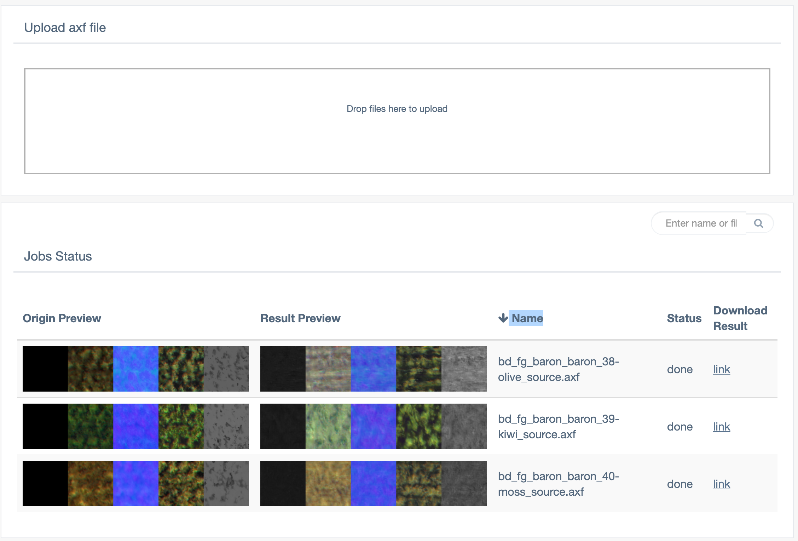

## Brutex tiler

### Setup:

1. Download from Google Drive pre-trained weights 
2. Create data folder and sync weights by the defined path

```shell script
DATA_FOLDER=/absolute/path/to/data_folder/
WEIGHTS=/absolute/path/to/downloaded/weights/
CONFIG=/absolute/path/to/config.json

mkdir -p ${DATA_FOLDER}/checkpoints/pretrained/
rsync -av ${WEIGHTS} ${DATA_FOLDER}/checkpoints/pretrained/
```

3. Download images

```shell script
docker pull ***:webservwer
docker pull ***:worker
```

4. Config file `config.json`

```json
{
  "SECRET_KEY": "supersecretkey123",
  "UPLOAD_FOLDER": "data/upload/",
  "RESULT_FOLDER": "data/result/",
  "JOBS_FOLDER": "data/jobs/",
  "BURIED": "data/jobs/.buried/",
  "RESERVED": "data/jobs/.reserved/",
  "DONE": "data/jobs/.deleted/",
  "THUMBNAIL_ORIG_FOLDER": "data/upload/thumbs/",
  "THUMBNAIL_RESULT_FOLDER": "data/result/thumbs/",
  "MODEL_FOLDER": "data/checkpoints/",
  "PRETRAINED": "pretrained",
  "TENSORBOARD": false,
  "MAX_CONTENT_LENGTH": 104857600,
  "STEPS": 8, 
  "OUTPUT_SIZE": 4096
}
```

**STEPS** - number of iterations ~10 minutes per iteration (1 - bad, 4 - better, 8 - good)
**OUTPUT_SIZE** - size of output axf NxN in px
**MAX_CONTENT_LENGTH** - default max content length for uploaded image (100Mb) 


#### RUN

1. Run webserwer

```shell script
docker run --rm -d \
-v ${CONFIG}:/home/ubuntu/ws/config.json \
-v ${DATA_FOLDER}:/home/ubuntu/ws/data/
-p 8080:8080
***:webserver
```

2. Run worker

```shell script
docker run --rm -d \
-v ${CONFIG}:/home/ubuntu/textureGAN/config.json \
-v ${DATA_FOLDER}:/home/ubuntu/textureGAN/data/
***:worker
```

#### UI

Statuses: 

OK: inqueue -> reserved -> done

FAIL: inqueue -> reserved -> buried

Result preview and download link are unavailable until processing is finished


